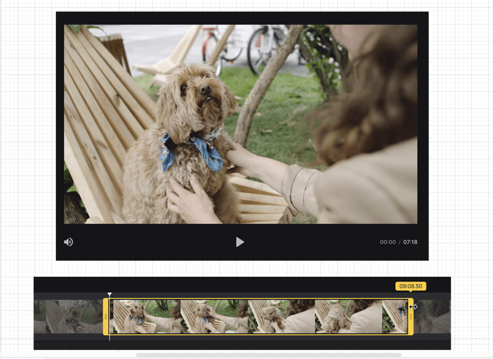

# Video Player Exercise 

### Step 1: Setup

Create a new React project using Create React App or your preferred setup.
Set up the basic project structure with a component directory and necessary files.

### Step 2: Component Structure

Create a VideoPlayer component as the main component for the video player.
Inside the VideoPlayer component, create child components for the timeline and the trim bar.

### Step 3: CSS Styling

Write CSS styles for the VideoPlayer component and its child components.
Use CSS Grid or Flexbox to arrange the components in the desired layout.
Style the timeline component to display the progress of the video and provide visual cues for the user.

### Step 4: Video Rendering

Use the HTML5 `video` tag to render the video within the VideoPlayer component.
Implement logic to load and play the video using React's state and event handling.

### Step 5: Timeline Implementation

Create a Timeline component responsible for displaying the progress of the video.
Use React's state to track the current video time and update the timeline accordingly.
Implement logic to allow users to click on the timeline to jump to a specific video time.

### Step 6: Trim Bar Implementation

Create a TrimBar component to allow users to adjust and move the trim bar to set the start and end points for trimming.
Use React's state to track the position of the trim bar and update the video accordingly.
Implement logic to restrict the trim bar's movement within the valid range of the video length.

### Step 7: Video Trimming

Handle user interactions to capture the start and end points set by the trim bar.
Update the video player's state to trim the video based on the selected time range.
Implement logic to preview the trimmed video without actually modifying the original video.

This project was bootstrapped with [Create React App](https://github.com/facebook/create-react-app).

## Available Scripts

In the project directory, you can run:

### `npm start`

Runs the app in the development mode.\
Open [http://localhost:3000](http://localhost:3000) to view it in the browser.